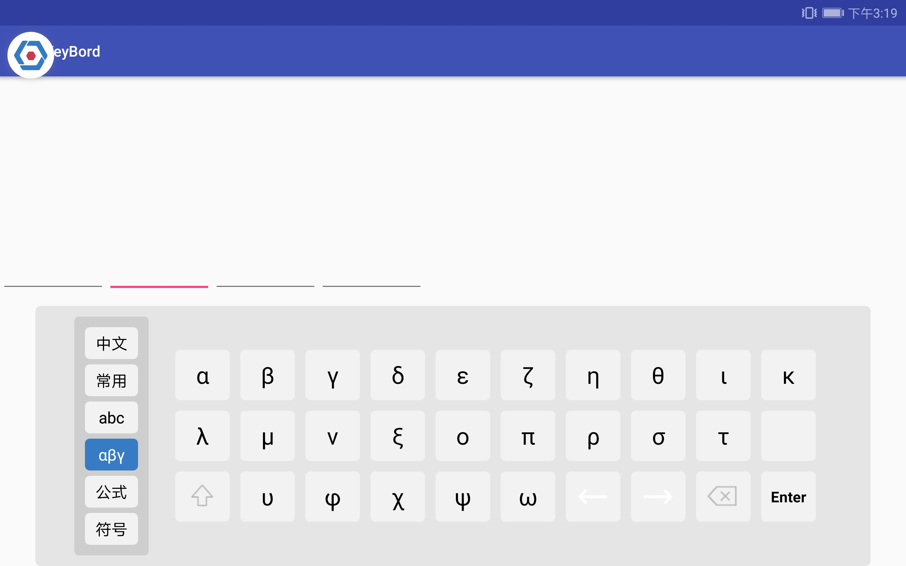

# SoftKeyBoard

自定义软键盘  包含 数字 ，字母，符号，希腊字母，等

  **效果**
    

1.使用

```allprojects {
allprojects {
		repositories {
			...
			maven { url 'https://jitpack.io' }
		}
	}
	
	
  dependencies {
	        implementation 'com.github.blueskky:SoftKeyBoard:1.0.0'
	}
```

2. 在activity中  activity要设为横屏     KeyboardType.MULTI_MAXIMUM  指定第一次出现时键盘类型

   ```
   KeyboardConfig configure = new KeyboardConfig();
   configure.setDefaultKeyboardType(KeyboardType.MULTI_MAXIMUM);
   CustomKeyboard.init(this,configure);
   ```

   

  指定特定的editText弹出的键盘类型

```
editText.setTag(R.id.input_type, KeyboardType.LETTER_ONLY);
```

